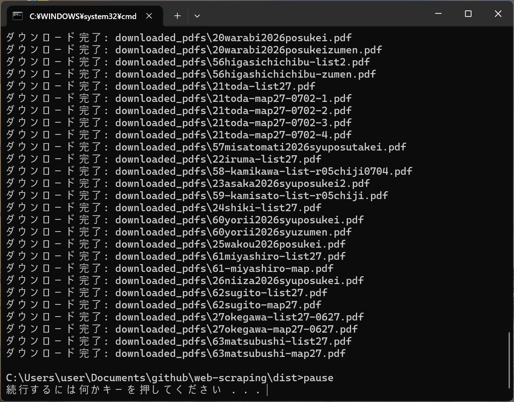

# Webスクレイピング

`Python`の`requests`、`BeautifulSoup4`を使用してWebをスクレイピングする

## 目次

1. [環境構築](#01)
1. [Webページをスクレイピングする](#02)
1. [`main.py`をexeファイルに変換する](#03)
1. [`main.exe`を実行するbatファイルを作成する](#04)
1. [使用方法（Windowsの場合）](#05)
1. [応用方法](#06)

<a id="01"></a>

## 環境構築

1. 必要なライブラリをインストールする
    - `Requests`：HTTPリクエストを送信してHTMLを取得するための標準的なライブラリ
    - `BeautifulSoup4`：HTMLの構造（DOM）を解析して、特定のタグやクラスのデータを抽出する。Requestsと組み合わせて使う

    ```
    pip install requests, beautifulsoup4
    ```

1. インストールしたライブラリを`requirements.txt`に記載する

    ```
    pip freeze > requirements.txt
    ```

    ※`requirements.txt`を作成しておけば、新たに環境構築する際、このファイルからライブラリを一度にインストールすることができる

    ```
    pip install -r requirements.txt
    ```

<a id="02"></a>

## Webページをスクレイピングする

Webページを`Requests`でデータを取得し、このデータを`BeautifulSoup4`で解析し、リンクの末尾が`.pdf`であるリンクから、`pdf`を抽出する

1. Webスクレイピングする`Scraping`クラスを作成する

    1. Webページの`URL`を引数にする`Scraping`クラスのコンストラクタを作成する

        `src/lib/scraping.py`

        ```
        import requests
        from bs4 import BeautifulSoup

        class Scraping:
            """ウェブサイトから情報を自動的に収集し、必要なデータを抽出・整形する
        
            Args:
                url(str): スクレイピング対象のウェブサイトのURL
            """
            def __init__(self, url:str) -> None:
                self.url = url
        ```

    1. Webページの`URL`からデータを取得する`get_html_in_text_format`メソッドを作成する

        `src/lib/scraping.py`

        ```
        import requests
        from bs4 import BeautifulSoup

        class Scraping:
            
            = 省略 =

            def get_html_in_text_format(self) -> str:
                """テキスト形式でHTMLを取得する

                Returns:
                    (str): テキスト形式のHTML文字列
                """
                try:
                    response = requests.get(self.url)
                    # HTTPステータスコードが200番台（成功）でない場合、HTTPErrorを発生させる
                    response.raise_for_status()
                    return response.text
                
                except requests.exceptions.RequestException as e:
                    print(f"URLの取得中にエラーが発生しました: {e}")
                    return e.__class__.__name__
        ```

    1. `get_html_in_text_format`メソッドの戻り値のデータからツリー構造に変換する`convert_to_tree_structure`メソッドを作成する

        `src/lib/scraping.py`

        ```
        import requests
        from bs4 import BeautifulSoup

        class Scraping:
            
            = 省略 =

            def convert_to_tree_structure(self, html_in_text_format:str) -> BeautifulSoup:
                """ツリー構造に変換する

                Args:
                    html_in_text_format(str):テキスト形式のHTML文字列

                Returns:
                    ツリー構造化されたオブジェクト(BeautifulSoup): 
                """
                return BeautifulSoup(html_in_text_format, 'html.parser')
        ```

    1. aタグを検索しPDFのリンク一覧を返す`get_pdf_links_tag`メソッドを作成する

        `src/lib/scraping.py`

        ```
        import requests
        from bs4 import BeautifulSoup

        class Scraping:
            
            = 省略 =

            def get_pdf_links_tag(self, soup:BeautifulSoup) -> list[str]:
                """aタグを検索しPDFのリンク一覧を返す

                Args:
                    soup(BeautifulSoup):ツリー構造化されたオブジェクト

                Returns:
                    pdf_links(list): PDFファイルのリンク一覧
                """

                pdf_links = []
                for link in soup.find_all('a', href=True):
                    href = link['href']

                    # リンクの最後がpdfの拡張子がある場合
                    if href.endswith('.pdf') :
                        # 相対URLを絶対URLに変換
                        if not href.startswith(('http://', 'https://')):
                            href = requests.compat.urljoin(self.url, href)
                        pdf_links.append(href)
                return pdf_links
        ```

    1. PDFファイルのリンク一覧が取得できたかどうか確認する`is_exist_pdf_links`メソッドを作成する

        `src/lib/scraping.py`

        ```
        import requests
        from bs4 import BeautifulSoup

        class Scraping:
            
            = 省略 =

            def is_exist_pdf_links(self, pdf_links:list) -> bool:
                """PDFファイルのリンク一覧の存在確認

                Args:
                    pdf_links(list):PDFファイルのリンク一覧

                Returns:
                    (bool): True あり false なし
                """
                if len(pdf_links) == 0:
                    return False
                return True
        ```

    1. pdfのリンクからファイルをダウンロードさせる``メソッドを作成する

        `src/lib/scraping.py`

        ```
        import os
        import requests
        from bs4 import BeautifulSoup

        class Scraping:
            
            = 省略 =

            def download_pdf_files(self, pdf_links:list, output_folder='downloaded_pdfs') -> None:
                # ダウンロードフォルダを作成
                if not os.path.exists(output_folder):
                    os.makedirs(output_folder)

                for i, pdf_url in enumerate(pdf_links):

                    # ファイル名をURLから取得
                    file_name = os.path.join(output_folder, os.path.basename(pdf_url))

                    try:
                        pdf_response = requests.get(pdf_url, stream=True)
                        pdf_response.raise_for_status()

                        with open(file_name, 'wb') as f:
                            for chunk in pdf_response.iter_content(chunk_size=8192):
                                f.write(chunk)
                        print(f"ダウンロード完了: {file_name}")
                    except requests.exceptions.RequestException as e:
                        print(f"PDFのダウンロード中にエラーが発生しました: {e}")
        ```

1. `Scraping`クラスを使って`main.py`を作成する

    `main.py`

    ```
    import sys
    from src.lib.scraping import Scraping

    def run(target_url:str):
        scraping = Scraping(target_url)
        html_in_text_format = scraping.get_html_in_text_format()
        soup = scraping.convert_to_tree_structure(html_in_text_format=html_in_text_format)
        pdf_links = scraping.get_pdf_links_tag(soup=soup)
        if scraping.is_exist_pdf_links(pdf_links=pdf_links):
            scraping.download_pdf_files(pdf_links=pdf_links)

    if __name__ == "__main__":
        run(sys.argv[1])
    ```

<a id="03"></a>

## `main.py`をexeファイルに変換する

`PyInstaller`ライブラリを使用して、Pythonファイルからexeファイルを生成する

1. `PyInstaller`ライブラリをインストールする

    ```
    pip install pyinstaller
    ```

    ※`pip freeze > requirements.txt`でファイルを更新しておく

1. `main.py`のあるディレクトリへ移動しexeファイルを作成する

    ```
    pyinstaller --onefile main.py
    ```

    実行後、新しくフォルダやファイルが作成される

    ```
    web-scraping
    ├─build
    ├─dist
    |  └─main.ext
    └─main.spec
    ```

    ※この`.exe`ファイルをダブルクリックすれば、`Python`環境がないパソコンでもプログラムが起動することができる

<a id="04"></a>

## `main.exe`を実行するbatファイルを作成する

    `main.bat`

    ```
    cd dist
    main.exe https://www.pref.saitama.lg.jp/e1701/documents/poster/2026syuinsenposukei.html

    pause
    ```

<a id="05"></a>

## 使用方法（Windowsの場合）

1. main.batを実行する
    
    main.batをダブルクリックすると、distフォルダ直下に`downloaded_pdfs`フォルダが自動生成され、PDFファイルが格納される
    ```
    web-scraping
     ├─dist
     |  ├─downloaded_pdfs
     |  |  ├─01-01-nishi-list-r05chiji.pdf
     |  |  ├─01-02kita-list.pdf
     |  |  ├─・・・
     |  ├─main.exe
     |  ├─・・・
    ```

    ※Webスクレイピングしたサイトは、[埼玉県の第51回衆議院議員総選挙（令和8年2月8日執行）におけるポスター掲示場](https://www.pref.saitama.lg.jp/e1701/documents/poster/2026syuinsenposukei.html)

    


<a id="06"></a>

## 応用方法
PDFファイルが`a`タグでリンク付けされているサイトであればダウンロードが可能

その場合、main.batの中身を書き換える

main.batの中身
```
cd dist
main.exe ** ここにPDFファイルが<a herf>タグでリンク付けされているサイトのURLを貼り付ける **
```