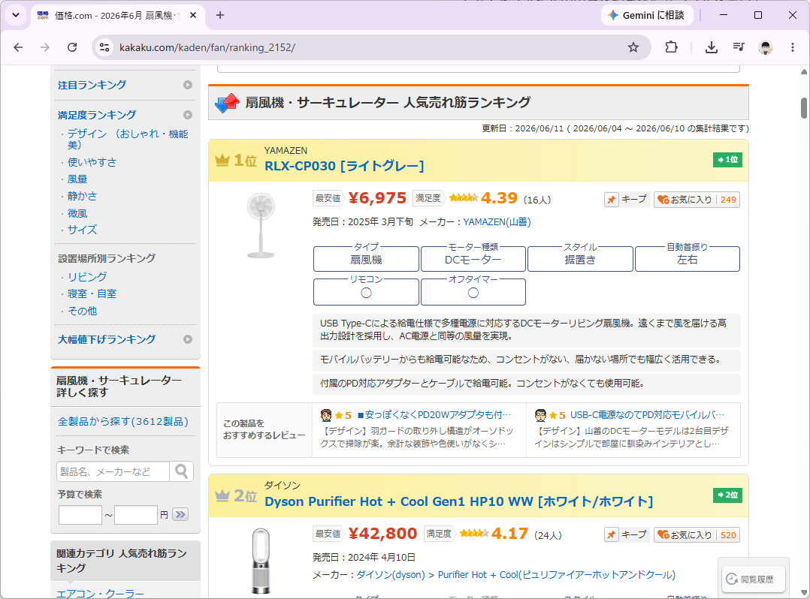
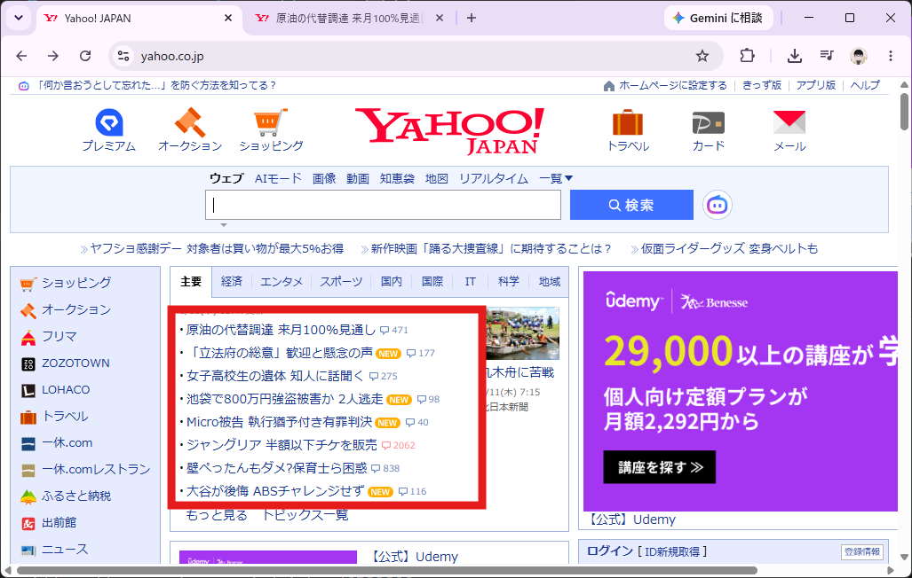
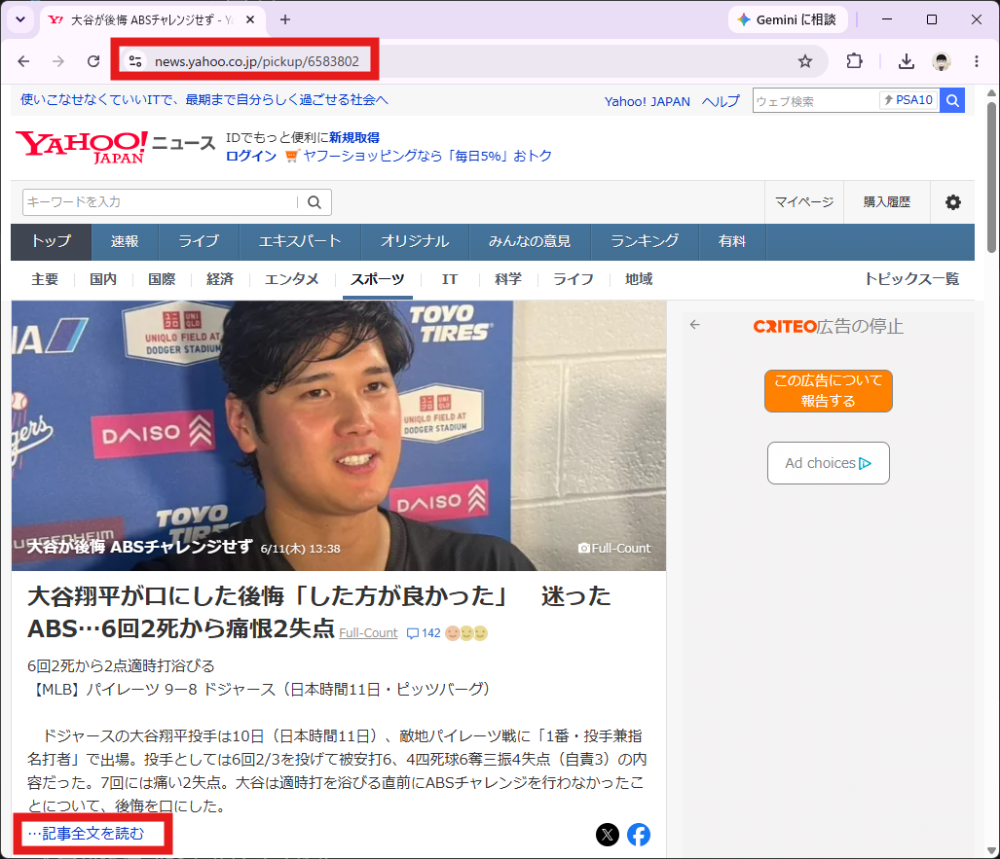
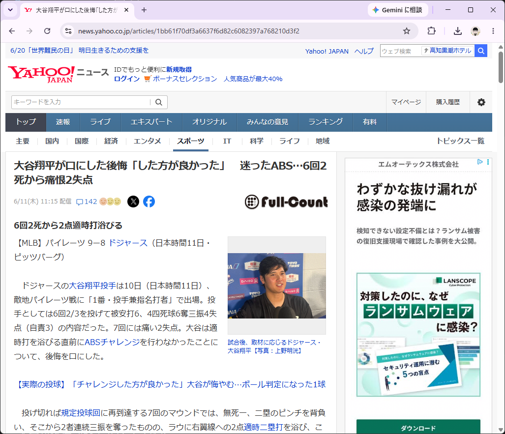
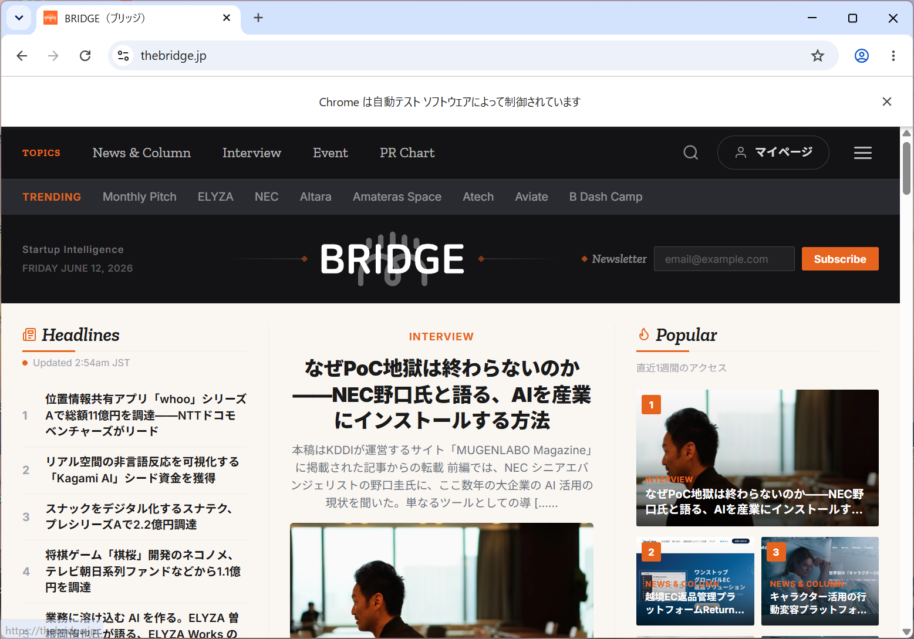
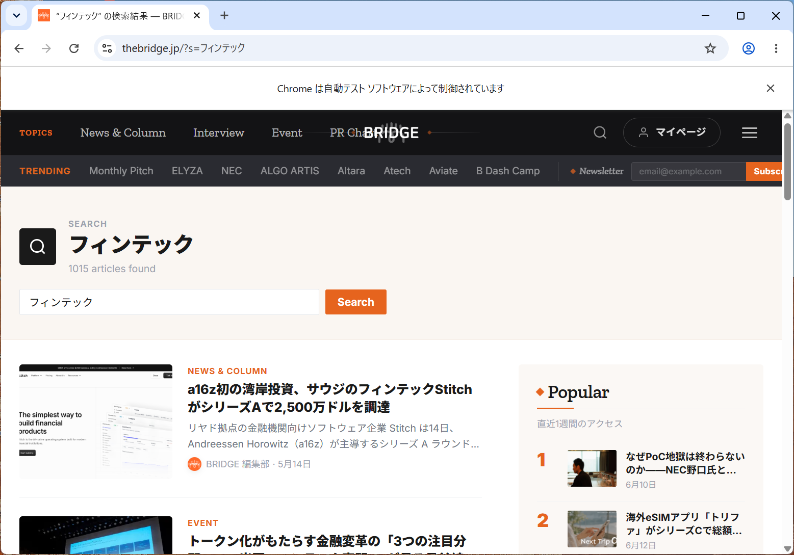

# Udemy講座

Udemiy講座の[Pythonによるビジネスに役立つWebスクレイピング（BeautifulSoup・Selenium・Requests）](https://www.udemy.com/course/python-web-scraping-with-beautifulsoup-selenium-requests/?couponCode=MT260608JP)を学習する

## 学習内容

- `Requests`や`BeautifulSoup4`ライブラリを用いてWebサイトをスクレイピングする
- `Selenium`ライブラリを用いて動的なWebサイトをスクレイピングする

## `Requests`や`BeautifulSoup4`ライブラリを用いてWebサイトをスクレイピングする

- `Requests`：HTTPリクエストを送信してHTMLを取得するための標準的なライブラリ
- `BeautifulSoup4`：HTMLの構造（DOM）を解析して、特定のタグやクラスのデータを抽出する。Requestsと組み合わせて使う

1. ライブラリをインストールする

    ```
    PS C:\Users\user\Documents\github\web-scraping> pip install requests, beautifulsoup4
    ```

1. `Scraping`クラスを作成する

    `src/lib/scraping.py`

    ```
    import os

    import requests
    from bs4 import BeautifulSoup

    class Scraping:
        """ウェブサイトから情報を自動的に収集し、必要なデータを抽出・整形する
        
        Args:
            url(str): スクレイピング対象のウェブサイトのURL
        """
        def __init__(self, url:str) -> None:
            self.url = url
        
        def get_html_in_text_format(self) -> str:
            """テキスト形式でHTMLを取得する

            Returns:
                (str): テキスト形式のHTML文字列
            """
            try:
                response = requests.get(self.url)
                # HTTPステータスコードが200番台（成功）でない場合、HTTPErrorを発生させる
                response.raise_for_status()
                return response.text
            
            except requests.exceptions.RequestException as e:
                print(f"URLの取得中にエラーが発生しました: {e}")
                return e.__class__.__name__
            
        def convert_to_tree_structure(self, html_in_text_format:str) -> BeautifulSoup:
            """ツリー構造に変換する

            Args:
                html_in_text_format(str):テキスト形式のHTML文字列

            Returns:
                ツリー構造化されたオブジェクト(BeautifulSoup): 
            """
            return BeautifulSoup(html_in_text_format, 'html.parser')
        
        def get_pdf_links_tag(self, soup:BeautifulSoup) -> list[str]:
            """aタグを検索しPDFのリンク一覧を返す

            Args:
                soup(BeautifulSoup):ツリー構造化されたオブジェクト

            Returns:
                pdf_links(list): PDFファイルのリンク一覧
            """

            pdf_links = []
            for link in soup.find_all('a', href=True):
                href = link['href']

                # リンクの最後がpdfの拡張子がある場合
                if href.endswith('.pdf') :
                    # 相対URLを絶対URLに変換
                    if not href.startswith(('http://', 'https://')):
                        href = requests.compat.urljoin(self.url, href)
                    pdf_links.append(href)
            return pdf_links
        
        def is_exist_pdf_links(self, pdf_links:list) -> bool:
            """PDFファイルのリンク一覧の存在確認

            Args:
                pdf_links(list):PDFファイルのリンク一覧

            Returns:
                (bool): True あり false なし
            """
            if len(pdf_links) == 0:
                return False
            return True
        
        def download_pdf_files(self, pdf_links:list, output_folder='downloaded_pdfs') -> None:
            # ダウンロードフォルダを作成
            if not os.path.exists(output_folder):
                os.makedirs(output_folder)

            for i, pdf_url in enumerate(pdf_links):

                # ファイル名をURLから取得
                file_name = os.path.join(output_folder, os.path.basename(pdf_url))

                try:
                    pdf_response = requests.get(pdf_url, stream=True)
                    pdf_response.raise_for_status()

                    with open(file_name, 'wb') as f:
                        for chunk in pdf_response.iter_content(chunk_size=8192):
                            f.write(chunk)
                    print(f"ダウンロード完了: {file_name}")
                except requests.exceptions.RequestException as e:
                    print(f"PDFのダウンロード中にエラーが発生しました: {e}")
    ```

1. [価格ドットコム>家電>扇風機・サーキュレーター>人気売れ筋ランキング](https://kakaku.com/kaden/fan/ranking_2152/)のWebサイトから`商品名`、`URL`を取得する

    

    `udemy/test.py`

    ```
    from src.lib.scraping import Scraping

    def main():
        target_url = "https://kakaku.com/kaden/fan/ranking_2152/"
        response = Scraping(target_url)
        context = response.get_html_in_text_format()
        soup = response.convert_to_tree_structure(context)
        elems = soup.find_all("div", class_="rkgBox")

        for elem in elems:
            print(elem.find("span", class_="rkgBoxNameItem").string)
            print(elem.find("a", class_="rkgBoxLink")["href"])

    if __name__ == "__main__":
        main()
    ```

    ```
    PS C:\Users\user\Documents\github\web-scraping> python -m udemy.test
    ```

    ```
    RLX-CP030 [ライトグレー]
    https://kakaku.com/item/K0001680404/
    Dyson Purifier Hot + Cool Gen1 HP10 WW [ホワイト/ホワイト]
    https://kakaku.com/item/K0001619113/
    Dyson HushJet Mini Cool ファン [インク/コバルト]
    https://kakaku.com/item/K0001780209/
    PK-18S03-H [ライトグレー]
    https://kakaku.com/item/K0001780223/
    PJ-T3DS-W [ホワイト系]
    https://kakaku.com/item/K0001685572/
    Dyson Purifier Cool Gen1 TP10 WW [ホワイト/ホワイト]
    https://kakaku.com/item/K0001619110/
    WOOZOO PCF-BC15TEC-W [ホワイト]
    https://kakaku.com/item/K0001684022/
    洗えるサーキュレーター YAS-TCFVW15(C) [グレージュ]
    https://kakaku.com/item/K0001781260/
    F-C324D-W [ホワイト]
    https://kakaku.com/item/K0001773771/
    KI-327DC(G) [グレー]
    https://kakaku.com/item/K0001626916/
    TF-30DL29(W) [ホワイト]
    https://kakaku.com/item/K0001773423/
    PK-18S03-B [アッシュブラック]
    https://kakaku.com/item/K0001780222/
    TURBOBLADE TF200SJBK [チャコールグレー]
    https://kakaku.com/item/K0001774998/
    F-C337D-W [ホワイト]
    https://kakaku.com/item/K0001773770/
    HEF-DL300H
    https://kakaku.com/item/K0001778815/
    REON POCKET 6 RNPK-6 [ライトグレー]
    https://kakaku.com/item/K0001784510/
    PJ-U3DS-W [ホワイト系]
    https://kakaku.com/item/K0001780221/
    PCF-SDC15T-EC-W [ホワイト]
    https://kakaku.com/item/K0001616417/
    WOOZOO 360 barrel PCF-CD15TECA-W [ホワイト]
    https://kakaku.com/item/K0001683490/
    LFD-307LE-W [ホワイト]
    https://kakaku.com/item/K0001689102/
    F-D237D-W [ホワイト]
    https://kakaku.com/item/K0001773667/
    YGT-DH3424HFR(W) [オフホワイト]
    https://kakaku.com/item/K0001778776/
    TF-30AL28(W) [ホワイト]
    https://kakaku.com/item/K0001684127/
    Dyson Purifier Cool PC2 De-NOx TP12 WG [ホワイト/ゴールド]
    https://kakaku.com/item/K0001658249/
    RC-AA30-WA [ホワイト]
    https://kakaku.com/item/K0001773978/
    Dyson Hot + Cool HF1 remote link pre-heat [ホワイト/シルバー]
    https://kakaku.com/item/K0001718024/
    Silky Wind Mobile 3.2 9ZF040RH08 [ライトグレー]
    https://kakaku.com/item/K0001665867/
    PJ-T3AS-W [ホワイト系]
    https://kakaku.com/item/K0001685573/
    FCA-154DWH [ホワイト]
    https://kakaku.com/item/K0001687889/
    F-C339D-W [ホワイト]
    https://kakaku.com/item/K0001773666/
    WOOZOO STF-DC15TEC-W [ホワイト]
    https://kakaku.com/item/K0001681559/
    FCR-BWG405(W) [ホワイト]
    https://kakaku.com/item/K0001779878/
    HEF-DL300G
    https://kakaku.com/item/K0001684020/
    W3800511 [ホワイト]
    https://kakaku.com/item/K0001650816/
    The GreenFan EGF-1800-WK [ホワイトxブラック]
    https://kakaku.com/item/K0001528084/
    WOOZOO PCF-BD15BTEC-W [ホワイト]
    https://kakaku.com/item/K0001783380/
    Dyson Purifier Hot + Cool HP2 De-NOx HP12 WG [ホワイト/ゴールド]
    https://kakaku.com/item/K0001657346/
    RC-AA30-HA [グレー]
    https://kakaku.com/item/K0001773977/
    TF-30DL28(W) [ホワイト]
    https://kakaku.com/item/K0001684126/
    KI-1710(W) [ホワイト]
    https://kakaku.com/item/K0001613731/
    ```

1. [yahoo! japan>主要ニュース記事](https://www.yahoo.co.jp/)のWebサイトから`ニュースタイトル`と`URL`を取得する

    

    `udemy/test_2.py`

    ```
    from src.lib.scraping import Scraping

    def main():
        target_url = "https://www.yahoo.co.jp/"
        web_page = Scraping(url=target_url)
        context = web_page.get_html_in_text_format()
        soup = web_page.convert_to_tree_structure(context)

        elems = soup.find_all("li", class_="_2j0udhv5jERZtYzddeDwcv")
        for elem in elems:
            print(elem.find("span", class_="fQMqQTGJTbIMxjQwZA2zk").string)
            print(elem.find("a", class_="yMWCYupQNdgppL-NV6sMi")["href"])

    if __name__ == "__main__":
        main()
    ```

    ```
    PS C:\Users\user\Documents\github\web-scraping> python -m udemy.test_2
    ```

    ```
    原油の代替調達 来月100%見通し
    https://news.yahoo.co.jp/pickup/6583787
    「立法府の総意」歓迎と懸念の声
    https://news.yahoo.co.jp/pickup/6583789
    女子高校生の遺体 知人に話聞く
    https://news.yahoo.co.jp/pickup/6583795
    池袋で800万円強盗被害か 2人逃走
    https://news.yahoo.co.jp/pickup/6583800
    Micro被告 執行猶予付き有罪判決
    https://news.yahoo.co.jp/pickup/6583803
    ジャングリア 半額以下チケを販売
    https://news.yahoo.co.jp/pickup/6583790
    壁ぺったんもダメ?保育士ら困惑
    https://news.yahoo.co.jp/pickup/6583793
    大谷が後悔 ABSチャレンジせず
    https://news.yahoo.co.jp/pickup/6583802
    ```

1. Webサイトから取得した`URL`へアクセスし、サイト内の「…記事全文を読む」の`URL`を取得する

    タイトル「大谷が後悔 ABSチャレンジせず」にアクセスし「…記事全文を読む」へアクセスする

    

    `udemy/test_2.py`

    ```
    from src.lib.scraping import Scraping

    def main():
        target_url = "https://www.yahoo.co.jp/"
        web_page = Scraping(url=target_url)
        context = web_page.get_html_in_text_format()
        soup = web_page.convert_to_tree_structure(context)

        elems = soup.find_all("li", class_="_2j0udhv5jERZtYzddeDwcv")
        pickup_links = [elem.find("a", class_="yMWCYupQNdgppL-NV6sMi")["href"] for elem in elems]

        for pickup_link in pickup_links:
            pickup_web_page = Scraping(pickup_link)
            pickup_context = pickup_web_page.get_html_in_text_format()
            pickup_soup = pickup_web_page.convert_to_tree_structure(pickup_context)
            pickup_elems = pickup_soup.find("div", class_="sc-gdv5m1-8 iubQsz")
            if pickup_elems:
                new_link = pickup_elems.a.attrs["href"]
                print(new_link)

    if __name__ == "__main__":
        main()
    ```

    ```
    PS C:\Users\user\Documents\github\web-scraping> python -m udemy.test_2
    ```

    ```
    https://news.yahoo.co.jp/articles/8a25ec4982b6914363c1ed5eb56c21f10f208d31
    https://news.yahoo.co.jp/articles/7e2041c932fd1269e2d857914b0471d621e180bc
    https://news.yahoo.co.jp/articles/af18a80c1ade76872b8a6732d990388ef9614ba5
    https://news.yahoo.co.jp/articles/76089be9d5cd14122decf1cc0f0721a6a9e3a458
    https://news.yahoo.co.jp/articles/4731d4b6edc49812f334c849f4dbd9b7d5a1830b
    https://news.yahoo.co.jp/articles/e9b118fa5cca8ed0e8d89a9d97e352ac08621f4b
    https://news.yahoo.co.jp/articles/1bb61f70df3a6637f6d82c6082397a768210d3f2
    ```

1. 取得したサイト内の「…記事全文を読む」の`URL`へアクセスし、本文を取得する

    

    `udemy/test_2.py`

    ```
    from src.lib.scraping import Scraping

    def main():
        target_url = "https://www.yahoo.co.jp/"
        web_page = Scraping(url=target_url)
        context = web_page.get_html_in_text_format()
        soup = web_page.convert_to_tree_structure(context)

        elems = soup.find_all("li", class_="_2j0udhv5jERZtYzddeDwcv")
        pickup_links = [elem.find("a", class_="yMWCYupQNdgppL-NV6sMi")["href"] for elem in elems]

        for pickup_link in pickup_links:
            pickup_web_page = Scraping(pickup_link)
            pickup_context = pickup_web_page.get_html_in_text_format()
            pickup_soup = pickup_web_page.convert_to_tree_structure(pickup_context)
            pickup_elems = pickup_soup.find("div", class_="sc-gdv5m1-8 iubQsz")
            if pickup_elems:
                new_link = pickup_elems.a.attrs["href"]
                print(new_link)

                new_web_page = Scraping(new_link)
                new_context = new_web_page.get_html_in_text_format()
                new_soup = new_web_page.convert_to_tree_structure(new_context)
                print(new_soup.title.text)
                print(new_soup.find(class_="article_body highLightSearchTarget").text, end="\n\n\n")


    if __name__ == "__main__":
        main()
    ```

    ```
    PS C:\Users\user\Documents\github\web-scraping> python -m udemy.test_2
    ```

    ```
    https://news.yahoo.co.jp/articles/8a25ec4982b6914363c1ed5eb56c21f10f208d31
    木原官房長官、中東情勢の悪化懸念（時事通信） - Yahoo!ニュース
    記者会見する木原稔官房長官＝１１日午前、首相官邸　木原稔官房長官は11日の記者会見で、米イランの戦闘終結に向けた交渉が停滞する中で、両国の攻撃の応酬が続いていることについて、「重大な関心を持って注視している。停戦が維持され、事態のさらなるエスカレーションにつながらないことを強く望む」と懸念を表明した。

    【ひと目でわかる】ホルムズ海峡

    　
    　木原氏は、ホルムズ海峡の航行の安全確保は「世界全体にとって急務だ」と訴え、早期沈静化へ外交努力を続ける考えを示した。　


    https://news.yahoo.co.jp/articles/7e2041c932fd1269e2d857914b0471d621e180bc
    原油代替調達率 来月は「100％」の見通し アメリカ産など確保　高市総理が夕方の中東情勢関係閣僚会議で表明へ（テレビ朝日系（ANN）） - Yahoo!ニュース
    中東情勢を受けた原油の調達をめぐり、政府が進めてきた調達先の多角化によってホルムズ海峡を経由しない代替調達が、来月には100％に達する見通しとなったことがわかりました。

    【動画】製造業の4割「事業継続、半年以内で限界」　ホルムズ海峡の封鎖続けば原油代替調達率 来月は「100％」の見通し アメリカ産など確保　高市総理が夕方の中東情勢関係閣僚会議で表明へ政府は、中東情勢の混乱を受けて原油の調達先の多角化を進めていて、アメリカや中央アジア、アフリカなどからの調達を拡大してきました。

    今月の、ホルムズ海峡を経由しない代替調達率は8割程度になるとの見通しを示していますが、政府関係者によりますと、来月には、これが100％に達する見通しが立ったということです。

    高市総理大臣は夕方に中東情勢に関する関係閣僚会議を開催し、こうした状況を報告することにしています。テレビ朝日報道局


    https://news.yahoo.co.jp/articles/af18a80c1ade76872b8a6732d990388ef9614ba5
    神奈川 河川敷に女子高校生の遺体　知人男性が事情知っているか 殺人の疑い視野に捜査（テレビ朝日系（ANN）） - Yahoo!ニュース
    All Nippon NewsNetwork(ANN)神奈川県相模原市の河川敷で、女子高校生の遺体が見つかりました。警察は、遺体の状況から事件に巻き込まれたとみて捜査しています。

    　消防によりますと、11日午前2時すぎ、「未成年の女性が倒れている」「心肺停止状態」と119番通報がありました。

    　捜査関係者によりますと、相模原市南区の相模川の河川敷沿いで、17歳の女子高校生の遺体が見つかりました。

    　遺体の状況から事件に巻き込まれたとみられます。

    　警察は、10代の知人の男性が事情を知っているとみて、殺人の疑いも視野に捜査しています。テレビ朝日


    https://news.yahoo.co.jp/articles/85ec46b609866a210b8d2973941ebd2a980c1f40
    【速報】当時18歳高校生だった男に懲役20年を求刑【大学生集団暴行死】「俺ってそんなに悪いのかな」検察は「終始、主導したとは認められない」などとして役割や年齢を考慮　判決は25日（HBCニュース北海道） - Yahoo!ニュース
    当時18歳の高校生だった特定少年の男（29日の法廷スケッチ）北海道江別市で集団暴行を受けた大学生が死亡した強盗致死事件の裁判員裁判で、検察は11日、当時18歳の高校生だった特定少年の男に対して懲役20年を求刑しました。

    【画像を見る】無期懲役を求刑された川村葉音被告など（31枚）

    強盗致死、詐欺、詐欺未遂、窃盗の罪に問われているのは、当時18歳の高校生だった特定少年の男、当時16歳の少年、すでにこの裁判で無期懲役を求刑されている川村葉音被告（21）の3人です。

    起訴状などによりますと、3人は2024年10月、同じく強盗致死罪などで起訴されている八木原亜麻被告（21）と交際していた長谷知哉さん（当時20）に集団暴行を加え、キャッシュカードなどを奪い死亡させた罪に問われています。

    これまでの裁判で札幌地裁は、3人に強盗致死罪が成立する中間判断を示していて、争点は量刑となっています。

    10日に行われた弁護側の被告人質問で、特定少年の男は、過去の経験から孤独を避けるため、自分の判断よりも周りに合わせるようになったと話し、当日の犯行についても「被害者より自分を優先してしまった。嫌われたくない、安心したい気持ちを優先した結果だった」などと述べていました。

    また、「逮捕時はどんな気持ちでした？」と問われると、「俺ってそんなに悪いのかなと思ってました」「そのとき自分は片手で数えきれるくらいしかやってないのと、他の人は数えきれないくらいやっていたので」と述べていました。

    11日午後の論告求刑で、検察は、終始主導したとは認められない、犯行当時18歳であること、酌量減刑があり得ない事案でもないなどとして、懲役20年を求刑しました。

    裁判を巡っては、検察がすでに川村葉音被告（21）に無期懲役を求刑。19日には当時16歳の少年に対する論告求刑も行われます。

    3人の被告の判決は25日に言い渡される予定です。

    おことわり
    HBCでは、当時18歳の特定少年の被告を実名で報じるかどうか、事件ごとに判断しています。今回の事件は、1人の大学生の命が失われた結果の重大性、社会的影響の大きさなどを総合的に判断した結果、地上波テレビ放送では実名で報じることにしました。なお、デジタル配信の記事は、半永久的に残るインターネットの特性を考慮して匿名で報じています。


    https://news.yahoo.co.jp/articles/76089be9d5cd14122decf1cc0f0721a6a9e3a458
    人気過熱で販売中止の“皇居財布”　ネット抽選で販売再開へ（日テレNEWS NNN） - Yahoo!ニュース
    日テレNEWS NNN現在、販売を中止している「皇居財布」について、試験的なインターネット抽選販売の実施が発表されました。

    【画像】宮中晩さん会　天皇陛下お言葉「海でつながる親しい隣国」フィリピン大統領夫妻迎え

    皇居の東御苑内大手売店で販売されていた、がま口付き財布や長財布などの財布類については、SNS上などで「皇居財布」と呼ばれ、「パワースポットで縁起が良い」などと話題になり、財布を求めて開園前におよそ1000人の行列ができるほど人気が過熱。

    職員による対応が困難になったことなどから、2025年12月下旬から販売を中止していましたが、公益財団法人菊葉文化協会は、2026年6月から、正式な販売再開に向け、ネット抽選による販売を試験的に行うと発表しました。

    行列を防ぐために行われるネット抽選販売は、菊葉文化協会のホームページで申し込みを受け付け、当選した人が大手売店を訪れて購入する形式です。

    販売される財布は、がま口付き財布（最多7色）、長財布（最多9色）、クロコ長財布（最多7色）、カラー小銭入れ（最多9色）の全4種（最多32色）で、応募できるのは月に一度、1点のみです。

    例えば、最初に行われる7月引き渡し分の試行販売の抽選申し込みは6月12日から20日までで、7月中に売店に取りに来られる週を選んで応募すると、6月末日までに抽選結果が通知されるということです。

    この際、オンライン決済は行われず、当選者に送付された二次元コードを売店で提示して購入します。また、支払いは現金またはクレジットカードが利用できるということです。

    菊葉文化協会は、今回の試行の結果を踏まえて正式販売を再開する予定とし、「財布を購入するだけではなくて、皇居を見ていただけたら幸いです」としています。


    https://news.yahoo.co.jp/articles/4731d4b6edc49812f334c849f4dbd9b7d5a1830b
    泣く幼児の顔にホールケーキを何度も押し付ける動画炎上、弁護士「お祝いのいたずら、通用しない」（弁護士ドットコムニュース） - Yahoo!ニュース
    拡散している動画（SNSから／編集部で一部加工しています）泣いて嫌がる幼児の顔にホールケーキを何度も押しつける動画がSNSに投稿され、波紋を広げている。

    【ひどい】頭をおさえて顔をケーキに押し付ける瞬間

    RKB毎日放送（6月10日）によると、福岡県警は暴行容疑での立件を視野に捜査を始めたという。

    また、読売新聞オンライン（同日）は、福岡県内の児童相談所が児童福祉法に基づき幼児を一時保護したと報じている。幼児にけがはなかったという。

    動画では、女性が泣いて嫌がる幼児の顔にケーキを押し付けており、SNSでは5日以降に「虐待ではないか」との批判が相次いだ。

    報道によると、警察には数十件、児童相談所には約200件もの通報が寄せられたという。

    動画に映る女性が保護者かどうか明らかになっていないが、仮にこのような行為をした場合、どのような罪に問われる可能性があるのか。西口竜司弁護士に聞いた。●「暴行罪にあたる可能性は極めて高い」──今回の動画のように、泣いて嫌がる幼児の顔にホールケーキを複数回押しつける行為は、どのような罪に問われる可能性がありますか。

    まず、このような出来事が二度と起きないことを願うばかりです。

    今回の行為は、暴行罪に該当する可能性が極めて高いと考えます。

    刑法上の「暴行」とは、人の身体に対する不法な有形力の行使をいいます。殴る、蹴るといった行為だけでなく、今回のように嫌がる子どもの顔にケーキを何度も押しつける行為も、身体に対する不法な力の行使であることは明らかです。

    「お祝いのいたずらの延長」という言い訳は通用しないでしょう。

    被害者が泣いて嫌がっていることに加え、それが複数回繰り返されていることからも、本人の意思に反する不法な暴行と評価される可能性が高いと考えられます。

    ──仮にケガをさせていたらどうでしょうか。

    その場合は傷害罪（刑法204条）の成立も検討されます。

    報道では「幼児にけがはなかった」とされていますが、たとえば目や鼻にクリームが入り、炎症を起こした場合や、精神的ショックによってPTSD（心的外傷後ストレス障害）などの症状が生じた場合には、「生理的機能を害した」として傷害罪が成立する可能性があります。

    さらに仮に女性が母親などの親権者や保護者であった場合には、児童虐待防止法上の「身体的虐待」に該当する可能性があります。身体的虐待は、実際に外傷が生じていなくても、「外傷が生じるおそれ」があれば認定され得ます。

    児童相談所が迅速に一時保護に踏み切ったことについては、子どもの安全確保という観点から、妥当かつ必要な措置だったということになるでしょう。

    【取材協力弁護士】
    西口 竜司（にしぐち・りゅうじ）弁護士
    大阪府出身。法科大学院1期生。「こんな弁護士がいてもいい」というスローガンのもと、気さくで身近な弁護士をめざし多方面で活躍中。予備校での講師活動や執筆を通じての未来の法律家の育成や一般の方にわかりやすい法律セミナー等を行っている。SASUKE2015本戦にも参戦した。弁護士YouTuberとしても活動を開始している。Xリーグ選手でもある。
    事務所名：神戸マリン綜合法律事務所
    事務所URL：http://www.kobemarin.com/弁護士ドットコムニュース編集部


    https://news.yahoo.co.jp/articles/e9b118fa5cca8ed0e8d89a9d97e352ac08621f4b
    阪神　藤川球児監督に厳重注意と制裁金１０万円の処分　ＮＰＢが発表　１０日・ソフトバンク戦でリクエストに異議で退場処分（デイリースポーツ） - Yahoo!ニュース
    １０日のソフトバンク戦で７回、熊谷の判定を巡ったリプレー検証後に抗議する藤川監督（右）＝撮影・西田忠信　ＮＰＢは１１日、１０日にみずほペイペイドームで行われたソフトバンク－阪神戦で退場処分を受けた阪神・藤川球児監督に対し、制裁金１０万円と厳重注意の処分を行ったことを発表した。

    【写真】どっちが早い？問題となった熊谷が盗塁した瞬間　確かに微妙なタイミング

    　藤川監督は七回の攻撃で、熊谷が二盗でタッチアウトになったプレーについてリクエストを行使。リプレー検証の結果、判定は覆らなかった。

    　直後にベンチを出て審判団に異議申し立てしたことで退場処分が下された。アグリーメントにはリプレー検証による裁定は最終的なものであり、一切の異議申し立てや説明の要求は認められない。これに反した者と監督は試合から除かれる、と記されている。

    　ＮＰＢでは選手時代を通じて初の退場処分。試合後には「アンパイアの方も迷いがあったと思う。審判の方に侮辱であるとか、そういうつもりは一切ありません」と語っていた。

    　◆自身ＮＰＢ初の退場　藤川球児監督が就任後初の退場処分。現役時代を通じても初めてで、独立リーグ時代では、四国アイランドリーグｐｌｕｓ・高知でプレーしていた１５年に危険球で退場となった経験がある。

    　◆リクエストへの異議による監督退場者　他球団では広島・緒方孝市監督が１９年５月４日・巨人戦（マツダ）初回に２番・菊池涼の判定に対するリクエストの異議申し立てをしたとして退場処分。また、巨人・阿部慎之助監督が２５年７月２日・阪神戦（甲子園）で。


    https://news.yahoo.co.jp/articles/1bb61f70df3a6637f6d82c6082397a768210d3f2
    大谷翔平が口にした後悔「した方が良かった」　迷ったABS…7回2死から痛恨2失点（Full-Count） - Yahoo!ニュース
    7回2死から2点適時打浴びる試合後、取材に応じるドジャース・大谷翔平【写真：上野明洸】【MLB】パイレーツ 9ー8 ドジャース（日本時間11日・ピッツバーグ）

    　ドジャースの大谷翔平投手は10日（日本時間11日）、敵地パイレーツ戦に「1番・投手兼指名打者」で出場。投手としては6回2/3を投げて被安打6、4四死球6奪三振4失点（自責3）の内容だった。7回には痛い2失点。大谷は適時打を浴びる直前にABSチャレンジを行わなかったことについて、後悔を口にした。

    【実際の投球】「チャレンジした方が良かった」大谷が悔やむ…ボール判定になった1球

    　投げ切れば規定投球回に再到達する7回のマウンドでは、無死一、二塁のピンチを背負い、そこから2者連続三振を奪ったものの、ラウに右翼線への2点適時二塁打を浴び、ここでロバーツ監督が降板を告げた。

    　ラウの打席では際どい投球が2球、ボール判定に。MLB公式サイトの配球チャートではストライクのコースに入っていただけに、「際どい所に行っていたので、迷いましたけど、チャレンジした方が良かったのかなと。結果的には」と振り返った。

    　3失点以上を喫するのは今季初。防御率は今季初めて1点台に乗って1.06となった。「基本的には（ABSの要求は）キャッチャーがやるという方針ではあるので。相当自信がない限りやらないんですけど、シチュエーションがシチュエーションだったので、やっても良かったのかなと思います」と話した。Full-Count編集部
    ```

## `Selenium`ライブラリを用いて動的なWebサイトをスクレイピングする

- `Selenium`:ブラウザ自動操作ライブラリ

1. ライブラリをインストールする

    ```
    PS C:\Users\user\Documents\github\web-scraping> pip install selenium
    ```

1. `Selenium`のChromeドライバーを用いて、ブラウザでWEBサイト[BRIDGE](https://thebridge.jp/)を起動する

    `udemy/test_selenium.py`

    ```
    from selenium import webdriver
    from time import sleep

    def main():
        target_url = "https://thebridge.jp/"
        driver = webdriver.Chrome()
        driver.get(target_url)

        sleep(10)

    if __name__ == "__main__":
        main()
    ```

    ```
    PS C:\Users\user\Documents\github\web-scraping> python -m udemy.test_selenium
    ```

    次の通りChromeが起動し、画面上層部に「Chromeは自動テスト ソフトウェアによって制御されています」と表示される

    

1. `Selenium`を用いて、WEBサイト[BRIDGE](https://thebridge.jp/)でキーワード検索する

    `Selenium`で検索する主なメソッド

    |method|description|
    |---|---|
    |find_element(By.ID,id属性)|id属性で要素を検索する|
    |find_element(By.NAME, name属性)|name属性で要素を検索する|
    |find_element(By.CLASS_NAME, class属性)|class属性で要素を検索する|
    |find_element(By.TAG_NAME, タグ名)|タグ名で要素を検索する|
    |find_element(By.XPATH, XPath)|XPathで要素を検索する|
    |find_element(By.CSS_SELECTOR, CSSセレクタ)|CSSセレクタで要素を検索する|
    |find_element(By.LINK_TEXT, リンクテキスト)|リンクテキストで要素を検索する|
    |find_element(By.PARTIAL_LINK_TEXT, リンクテキストの一部)|リンクテキストの一部で要素を検索する|

    `Selenium`で扱う特殊キー入力

    |key|description|
    |---|---|
    |Keys.ENTER|Enterキー|
    |Keys.SHIFT|Shiftキー|
    |Keys.TAB|Tabキー|
    |Keys.ALT|Altキー|
    |Keys.CONTROL|Ctrキー|
    |Keys.UP|↑キー|
    |Keys.DOWN|↓キー|
    |Keys.LEFT|←キー|
    |Keys.RIGHT|→キー|

    `udemy/test_selenium.py`

    ```
    from selenium import webdriver
    from selenium.webdriver.common.by import By
    from selenium.webdriver.common.keys import Keys
    from time import sleep

    def main():
        target_url = "https://thebridge.jp/"
        driver = webdriver.Chrome()
        driver.get(target_url)

        search_word = "フィンテック"

        button_xpath = "//button[contains(@class, 'header-search')]"
        search_button = driver.find_element(By.XPATH, button_xpath)
        search_button.click()

        input_xpath = "//input[@type='search']"
        search_input = driver.find_element(By.XPATH, input_xpath)
        search_input.send_keys(search_word)

        # フォームをSubmitする場合
        # search_input.submit()

        # フォームでEnterキーを押下する場合
        search_input.send_keys(Keys.ENTER)

        sleep(10)

    if __name__ == "__main__":
        main()
    ```

    ```
    PS C:\Users\user\Documents\github\web-scraping> python -m udemy.test_selenium
    ```

    次の通り表示されれば成功！

    

1. 検索結果で表示された記事のタイトルとURLを取得する

    `udemy/test_selenium.py`

    ```
    from selenium import webdriver
    from selenium.webdriver.common.by import By
    from selenium.webdriver.common.keys import Keys
    from time import sleep

    def main():
        target_url = "https://thebridge.jp/"
        driver = webdriver.Chrome()
        driver.get(target_url)

        search_word = "フィンテック"

        button_xpath = "//button[contains(@class, 'header-search')]"
        search_button = driver.find_element(By.XPATH, button_xpath)
        search_button.click()

        input_xpath = "//input[@type='search']"
        search_input = driver.find_element(By.XPATH, input_xpath)
        search_input.send_keys(search_word)

        # フォームをSubmitする場合
        # search_input.submit()

        # フォームでEnterキーを押下する場合
        search_input.send_keys(Keys.ENTER)

        sleep(10)

        h3_a_xpath = "//h3/a"
        for elem in driver.find_elements(By.XPATH, h3_a_xpath):
            print(elem.text)
            print(elem.get_attribute("href"))

    if __name__ == "__main__":
        main()
    ```

    ```
    PS C:\Users\user\Documents\github\web-scraping> python -m udemy.test_selenium
    ```

    ```
    a16z初の湾岸投資、サウジのフィンテックStitchがシリーズAで2,500万ドルを調達
    https://thebridge.jp/2026/05/a16z-saudi-fintech-stitch-25m-series-a
    トークン化がもたらす金融変革の「3つの注目分野」——米国フィンテック専門VCが見る最前線
    https://thebridge.jp/2026/04/tokenization-financial-transformation-three-sectors-us-fintech-vc
    ブロックチェーン・フィンテック向け決済インフラのTazapay、Circleが主導するシリーズB拡張ラウンドで総額3,600万ドル調達
    https://thebridge.jp/2026/04/tazapay-series-b-circle-36m
    2024年上半期テック投資動向：好調なAIとサイバーセキュリティ、1.7億ドル集めたフィンテックのTallyは事業を停止
    https://thebridge.jp/2024/08/tech-investment-trends-in-the-first-half-of-2024
    CyberAgent Pitching Arena 2024（４）：インドネシアの建設現場の遅延を、資材調達とフィンテックで解決する「GoCement」
    https://thebridge.jp/2024/06/capa-2024-gocement-cyberagentcapital-insight
    フィンテックユニコーンのCircle、BitoGroupや台湾ファミマと提携——コンビニポイントをUSDCに交換可能に
    https://thebridge.jp/2023/11/circle-bitogroup-taiwan-familymart-partnership
    シンガポール発フィンテックコミュニティ「Elevandi」、日本法人が設立——世界のフィンテックと交流活性化狙う
    https://thebridge.jp/2023/10/elevandi-launches-japanese-subsidiary
    SaaSはフィンテックと融合するーーALL STAR SAAS FUNDが新ファンド、運用総額は1,300億円に
    https://thebridge.jp/2023/08/all-star-saas-fund-launched-3rd-fund-raising-110m
    2023年Q1で世界唯一のフィンテックユニコーンクラブ入り、エジプト「MNT-Halan」はどのように生まれたか？
    https://thebridge.jp/2023/05/all-about-mnt-halan
    ウェルネス業界向けSaaS「hacomono」運営、38.5億円をシリーズC調達——フィンテック事業に参入へ
    https://thebridge.jp/2023/04/hacomono-series-c-round-funding
    インフキュリオン、今年の日本のフィンテック業界を占う10大キーワードを発表
    https://thebridge.jp/2023/01/infcurion-top-ten-keywords-2023
    #34 フィンテックのレジェンドが考える、web3ビジネスの広げ方 〜Nudge沖田CEO × ACV唐澤・村上〜
    https://thebridge.jp/2022/12/how-to-expand-web3-business-accentureventures
    ```

1. `Selenium`のヘッドレスモードで実行する

    `Selenium`のヘッドレスモードは、Chromeドライバーを用いてブラウザ操作する際、ブラウザを表示させず裏で実行させる方法。これにより実行速度が上がる。

    `udemy/test_selenium.py`

    ```
    from selenium import webdriver
    from selenium.webdriver.common.by import By
    from selenium.webdriver.common.keys import Keys
    from time import sleep

    def main():
        target_url = "https://thebridge.jp/"

        # ヘッドレスモードに設定
        options = webdriver.ChromeOptions()
        options.add_argument("--headless")
        
        driver = webdriver.Chrome(options=options)
        driver.get(target_url)

        search_word = "フィンテック"

        button_xpath = "//button[contains(@class, 'header-search')]"
        search_button = driver.find_element(By.XPATH, button_xpath)
        search_button.click()

        input_xpath = "//input[@type='search']"
        search_input = driver.find_element(By.XPATH, input_xpath)
        search_input.send_keys(search_word)

        # フォームをSubmitする場合
        # search_input.submit()

        # フォームでEnterキーを押下する場合
        search_input.send_keys(Keys.ENTER)

        sleep(10)

        h3_a_xpath = "//h3/a"
        for elem in driver.find_elements(By.XPATH, h3_a_xpath):
            print(elem.text)
            print(elem.get_attribute("href"))

    if __name__ == "__main__":
        main()
    ```

    ```
    PS C:\Users\user\Documents\github\web-scraping> python -m udemy.test_selenium
    ```

    Chromeが起動せず、次のレスポンスが返ってくれば成功！

    ```
    a16z初の湾岸投資、サウジのフィンテックStitchがシリーズAで2,500万ドルを調達
    https://thebridge.jp/2026/05/a16z-saudi-fintech-stitch-25m-series-a
    トークン化がもたらす金融変革の「3つの注目分野」——米国フィンテック専門VCが見る最前線
    https://thebridge.jp/2026/04/tokenization-financial-transformation-three-sectors-us-fintech-vc
    ブロックチェーン・フィンテック向け決済インフラのTazapay、Circleが主導するシリーズB拡張ラウンドで総額3,600万ドル調達
    https://thebridge.jp/2026/04/tazapay-series-b-circle-36m
    2024年上半期テック投資動向：好調なAIとサイバーセキュリティ、1.7億ドル集めたフィンテックのTallyは事業を停止
    https://thebridge.jp/2024/08/tech-investment-trends-in-the-first-half-of-2024
    CyberAgent Pitching Arena 2024（４）：インドネシアの建設現場の遅延を、資材調達とフィンテックで解決する「GoCement」
    https://thebridge.jp/2024/06/capa-2024-gocement-cyberagentcapital-insight
    フィンテックユニコーンのCircle、BitoGroupや台湾ファミマと提携——コンビニポイントをUSDCに交換可能に
    https://thebridge.jp/2023/11/circle-bitogroup-taiwan-familymart-partnership
    シンガポール発フィンテックコミュニティ「Elevandi」、日本法人が設立——世界のフィンテックと交流活性化狙う
    https://thebridge.jp/2023/10/elevandi-launches-japanese-subsidiary
    SaaSはフィンテックと融合するーーALL STAR SAAS FUNDが新ファンド、運用総額は1,300億円に
    https://thebridge.jp/2023/08/all-star-saas-fund-launched-3rd-fund-raising-110m
    2023年Q1で世界唯一のフィンテックユニコーンクラブ入り、エジプト「MNT-Halan」はどのように生まれたか？
    https://thebridge.jp/2023/05/all-about-mnt-halan
    ウェルネス業界向けSaaS「hacomono」運営、38.5億円をシリーズC調達——フィンテック事業に参入へ
    https://thebridge.jp/2023/04/hacomono-series-c-round-funding
    インフキュリオン、今年の日本のフィンテック業界を占う10大キーワードを発表
    https://thebridge.jp/2023/01/infcurion-top-ten-keywords-2023
    #34 フィンテックのレジェンドが考える、web3ビジネスの広げ方 〜Nudge沖田CEO × ACV唐澤・村上〜
    https://thebridge.jp/2022/12/how-to-expand-web3-business-accentureventures
    ```